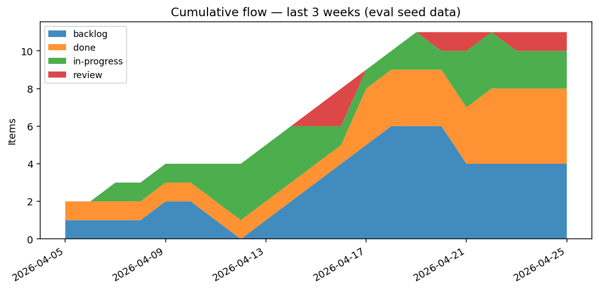

# yorph-taggy in practice

Fifteen worked examples, end-to-end. Every one of them is a real eval —
[`examples/run_evals.py`](examples/run_evals.py) seeds a deterministic
dataset, runs each example against it, and asserts on the result. If
something here drifts out of sync with the schema or the skill SQL, the
suite fails.

Each example below has the same shape:

> what you'd actually type in chat

```
what you see back — list, table, chart, or a short reply from the agent
```

<sub>*how it works underneath (one or two sentences, italics — skip if
you don't care about the schema).*</sub>

The audience is mixed. Skim the first two parts; only read the small
italics if you want to know how the schema makes it possible. There's a
collapsed `<details>` block on most examples with the actual SQL the
agent runs.

## Why this stays coherent

The agent has two layers of vocabulary, pulling in the same direction.

**Layer 1 — Jira-sense built in.** The agent ships knowing what `#bug` /
`#task` / `#story` / `#epic` mean, that statuses live under
`status:<value>`, that estimates are `points:<n>`, that sprints are
`sprint:<id>`, that assignees are `@<handle>`. This matches what most
teams already do, so first-day usage feels obvious.

**Layer 2 — a convention registry inside the database.** When a team
invents a new prefix the floor doesn't cover (a customer field, a
severity scale, a RICE score), the agent files a `convention:<prefix>`
item documenting it. Same `items` table, no new mechanism. Anyone who
joins the deployment tomorrow inherits the vocabulary the moment they
connect.

The Jira floor steers everyone toward orthodox practice from minute one.
The registry catches the cases the floor doesn't cover, and propagates
automatically. Nothing locks the team in: any prefix, any value, any
time. The schema never gets in the way.

## The dataset behind these examples

[`run_evals.py`](examples/run_evals.py) seeds 15 items across three
projects (`auth`, `recommender`, `billing`) plus two sprints, two
releases, an old project label that's about to be retired, and one
pre-existing custom convention (`area:`). Items have realistic histories
— backlog → in-progress → review → done transitions spread over the
past three weeks. Run it yourself:

```bash
python3 examples/run_evals.py
```

You'll see 15 `pass` lines and a clean exit. The eval database
(`taggy_eval`) is dropped and recreated each run, never touching your
real data.

---

# Filing

## 1. File a bug, find similar ones, link them

> "Got a complaint that login on staging.acme.com bounces back to the
> login page even after the right password — looks cookie-related."

```
1 similar item already in proj:auth:
  #2 — session cookie domain not respected on subdomains   (status:review, @alice)

File fresh and link to it, file as a child, or just comment on #2?

→  filed #16 — Login bounces back on staging subdomain even with correct password
   tags: #bug, p2, @alice, proj:auth, status:backlog, sprint:2026-q2-w1, relates:2
```

<sub>*Before filing, the agent runs a similarity search (ILIKE on title
and body, joined with the project tag). The cross-reference itself is a
new tag prefix `relates:<key>` — same row shape as `#bug` or `@alice`,
so it's searchable, time-stamped, and soft-deletable. No separate
"duplicates" table; tags are how everything in this system relates to
everything else, including other items.*</sub>

<details><summary>The query the agent runs</summary>

```sql
SELECT i.key, i.title
FROM items i
LEFT JOIN tags t ON t.item = i.key AND t.removed_at IS NULL
WHERE (i.title ILIKE '%cookie%' OR i.body ILIKE '%cookie%')
   OR i.key IN (SELECT item FROM tags WHERE tag = 'proj:auth' AND removed_at IS NULL)
GROUP BY i.key, i.title, i.updated_at
ORDER BY i.updated_at DESC
LIMIT 10;
```

Then a single `INSERT` into `items` and one `INSERT` per tag, including
`relates:2`.

</details>

## 2. Quick chat note → tracked task

> "Mental note: I should back up postgres before next week's release."

```
nothing similar found.
→  filed #17 — Back up postgres before next week's release   (#task, status:backlog)
```

<sub>*The lightest filing path. The schema mandates only `title` and
`created_by`; everything else is a tag, and the agent only adds tags it
can justify from what you said.*</sub>

## 3. File a child item under an existing one

> "On the login redirect bug, alice says she found the cause — the
> cookie write strips the query string. Add that as a comment."

```
on #1 — login redirect drops the next param after SSO:
→  added child #18 — alice: cause is the cookie write stripping the query string  (#comment)
```

<sub>*Comments aren't a separate table. They're items with a `parent`
set. Sub-tasks, doc pages, code-update summaries, change-log entries —
same shape. The hierarchy Jira fragments across five object types
collapses into one column.*</sub>

---

# Finding

## 4. Disambiguate "the login bug"

> "What's the status of the login bug?"

```
2 items match "login":
  #1 — login redirect drops the next param after SSO              (#bug, p1, status:done, @alice)
  #8 — Login page missing CSRF protection on forgot-password form (#bug, p2, status:backlog, @bob)

Which one?
```

<sub>*When an `ILIKE` match returns more than one row, the agent surfaces
all candidates with their full active-tag profile rather than picking
one. CLAUDE.md rule #4 — disambiguation by listing.*</sub>

## 5. Items in this sprint with no assignee

> "What's in this sprint that nobody's picked up yet?"

```
#5 — Auth audit log retention policy   (#task, p3, status:backlog)
```

<sub>*A `NOT EXISTS` against `tags WHERE tag LIKE '@%'`. Assignees are
tags, so "no assignee" is just "no row matching that predicate" — no
nullable column, no special "unassigned" sentinel.*</sub>

<details><summary>The query the agent runs</summary>

```sql
SELECT i.key, i.title
FROM items i
JOIN tags sp ON sp.item = i.key AND sp.tag = 'sprint:2026-q2-w1' AND sp.removed_at IS NULL
WHERE NOT EXISTS (
  SELECT 1 FROM tags t
  WHERE t.item = i.key AND t.tag LIKE '@%' AND t.removed_at IS NULL
);
```

</details>

## 6. "What's Alice been working on?"

> "What's Alice been up to this week?"

```
#1  — login redirect drops the next param after SSO
#2  — session cookie domain not respected on subdomains
#4  — Add WebAuthn passkey support
#7  — Auth flow design doc
#9  — Recommender model V2 design doc
#11 — Tune recommender ranker weights for diversity
#14 — Stripe webhook retries cause double-charges
```

<sub>*Three predicates UNION'd: items where `@alice` is currently active,
items where Alice tagged anything in the last 7 days, items where she
removed anything. The same `tags` table that holds the assignment also
stores who-did-what-when, so a person-centric view falls out for free.*</sub>

---

# History & time travel

## 7. "What changed on the login redirect bug this week?"

> "What changed on the login redirect bug this week?"

```
on #1 — login redirect drops the next param after SSO:
  Mon  alice  → status:review     (was: in-progress)
  Wed  alice  → status:done       (was: review)
  Thu  alice  + release:2026-w17
```

<sub>*Soft-deletes turn the `tags` table into a complete audit trail.
Every transition is two rows: one inserted (new state), one updated
(`removed_at` set on the old). "What changed in window X" is one
time-bounded UNION over `tagged_at` and `removed_at`.*</sub>

## 8. "What was the board on April 21?"

> "What did the board look like four days ago?"

```
status              | key | title
--------------------+-----+------------------------------------------------------------
status:backlog      | 4   | Add WebAuthn passkey support
status:backlog      | 5   | Auth audit log retention policy
status:backlog      | 8   | Login page missing CSRF protection on forgot-password form
status:backlog      | 11  | Tune recommender ranker weights for diversity
status:in-progress  | 2   | session cookie domain not respected on subdomains
status:in-progress  | 3   | CSRF token rotation flakes intermittently
status:in-progress  | 10  | Recommender stuck on cold start for new users
status:review       | 1   | login redirect drops the next param after SSO
```

<sub>*Point-in-time idiom: `tagged_at <= T AND (removed_at IS NULL OR
removed_at > T)`. Apply once for sprint membership, once for type, once
for status. Docs and comments don't appear because they don't carry
`#bug` / `#task` / `#story` / `#epic`.*</sub>

<details><summary>The query the agent runs</summary>

```sql
WITH t_at AS (SELECT now() - interval '4 days' AS T),
in_sprint AS (
  SELECT t.item FROM tags t, t_at WHERE t.tag = 'sprint:2026-q2-w1'
    AND t.tagged_at <= t_at.T AND (t.removed_at IS NULL OR t.removed_at > t_at.T)
),
of_type AS (
  SELECT DISTINCT t.item FROM tags t, t_at
  WHERE t.tag IN ('#bug','#task','#story','#epic')
    AND t.tagged_at <= t_at.T AND (t.removed_at IS NULL OR t.removed_at > t_at.T)
),
active_status AS (
  SELECT t.item, t.tag AS status FROM tags t, t_at
  WHERE t.tag LIKE 'status:%'
    AND t.tagged_at <= t_at.T AND (t.removed_at IS NULL OR t.removed_at > t_at.T)
)
SELECT s.status, i.key, i.title
FROM in_sprint sp
JOIN of_type ty ON ty.item = sp.item
JOIN active_status s ON s.item = sp.item
JOIN items i ON i.key = sp.item
ORDER BY s.status, i.key::int;
```

</details>

## 9. "Reopen that — I closed it by accident"

> "Reopen the login redirect bug, I shouldn't have closed it."

```
on #1: previous status before done was status:review (Wed). Restore?
→  status:done removed.  status:review re-added.
   the original review row stays on disk — full provenance preserved.
```

<sub>*Soft-delete makes undo cheap. The "previous state" is literally
still in the table; the agent finds it with one `ORDER BY removed_at
DESC LIMIT 1`. A year from now you can still see exactly when this was
closed, when it was reopened, by whom, and what the prior state was.*</sub>

---

# Aggregating & charts

## 10. Cumulative flow over the last three weeks

> "Show me a cumulative flow chart for the team."



```
backlog grew through week 1; in-progress filled as work got picked up;
review pops mid-window when items hit code review; done starts
accumulating once things ship. The dip in review on the right is items
moving cleanly through the pipeline, not a stall.
```

<sub>*"How many items had each status active on each day" is one
COUNT-FILTER query: cross-join a calendar with the distinct status tags,
apply the active-at-T predicate. No event log, no snapshot table.*</sub>

## 11. Cycle time for things we shipped this quarter

> "What's our cycle time looking like this quarter?"

```
key | title                                                 | days_in_progress
----+-------------------------------------------------------+------------------
1   | login redirect drops the next param after SSO         | 13.0
6   | Old auth middleware: replace with new auth middleware |  5.0
13  | Invoice PDF generation flaky on weekends              |  4.0
14  | Stripe webhook retries cause double-charges           |  4.0

→ #1 took 13 days, more than 3× the median. Worth a look.
```

<sub>*Each `status:in-progress` tag row stores both `tagged_at` and
`removed_at` — interval duration is one subtraction. Summing across a
re-opened item is automatic because each interval is its own row. No
"duration" column, no audit log to reconstruct.*</sub>

## 12. "Who's overloaded?"

> "Who's got the heaviest plate right now?"

```
@alice  13 active points
@bob    12 active points

→ even split — neither one's drowning.
```

<sub>*Three tag predicates joined: `points:%` for the estimate, `@%` for
the assignee, NOT EXISTS for `status:done`. The join key is the same
`item` column in all three. No users table, no projects table.*</sub>

---

# Restructuring

## 13. Promote a story into an epic with sub-tasks

> "Make the WebAuthn passkey one an epic — split it into registration,
> login, and account-settings UI."

```
on #4 — Add WebAuthn passkey support:
  #story → #epic
  + child #19 — passkey: registration flow
  + child #20 — passkey: login flow
  + child #21 — passkey: account-settings UI
```

<sub>*Hierarchy is a single column. There's no "epic" type, no "issue
link" object — both are the same `items` row, distinguished by their
`#story` / `#epic` tag. A story becoming an epic is one tag swap.*</sub>

## 14. Bulk relabel `proj:auth-old` → `proj:auth`

> "We don't have a separate auth-old project anymore. Move everything
> tagged `proj:auth-old` to `proj:auth`."

```
1 item carries proj:auth-old:
  #6 — Old auth middleware: replace with new auth middleware

Proceed?
→  proj:auth-old removed (history preserved). proj:auth added.
```

<sub>*Mass tag changes are normal `UPDATE` and `INSERT` scoped by tag
predicate. Confirmation is a CLAUDE.md rule, not a database constraint.
The old tag row stays on disk with its `removed_at` set — three months
from now you can still answer "what used to be in auth-old?"*</sub>

---

# Zero-DDL extensibility

## 15. Invent a new concept mid-conversation

> "Tag the audit-log task with severity sev2 — moderate impact."

```
"severity" is new. Registering it so the team stays in sync.
→  filed #16 — convention:severity   (sev0 = full outage … sev3 = cosmetic)
→  tagged #5 — Auth audit log retention policy   +severity:sev2

next time anyone runs the tracker skill, they'll see severity:* in the
vocabulary scan.
```

<sub>*Adding a new dimension — severity, customer, RICE, OKR — is a
tag-prefix decision, not a schema migration. The convention itself is
stored in the same `items` table, using the operations the agent already
knows. New vocabulary propagates the same way old vocabulary does:
through the database, not a wiki.*</sub>

---

# Running the evals yourself

```bash
python3 examples/run_evals.py
```

Each example above corresponds to a function in
[`run_evals.py`](examples/run_evals.py). The harness creates a fresh
`taggy_eval` Postgres database, applies the schema, seeds the dataset
described above, runs each eval inside its own transaction (rolled back
at the end so the seed stays pristine), prints `pass` / `FAIL` per
eval, and exits non-zero on any failure.

If you change the schema, the skills, or the seed, run the evals first.
A red line means the documentation here has drifted out of sync with
what the code actually does.
