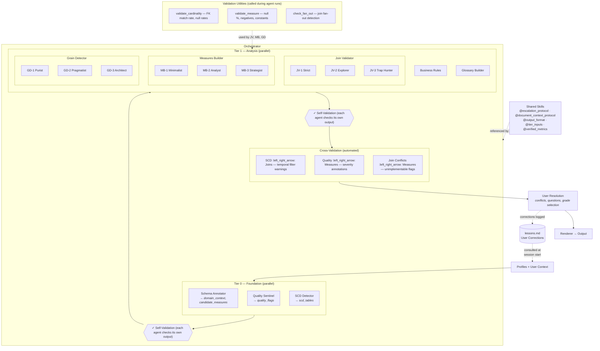

```mermaid
graph TB
    LESSONS[("lessons.md<br/>User Corrections")]
    LESSONS -.->|"consulted at<br/>session start"| INPUT

    INPUT["Profiles + User Context"]
    INPUT --> T0

    subgraph ORCH["Orchestrator"]

        subgraph T0["Tier 0 — Foundation (parallel)"]
            direction TB
            SA["Schema Annotator<br/><i>→ domain_context, candidate_measures</i>"]
            QS["Quality Sentinel<br/><i>→ quality_flags</i>"]
            SCD["SCD Detector<br/><i>→ scd_tables</i>"]
        end

        SV0{{"✓ Self-Validation (each agent checks its own output)"}}

        subgraph T1["Tier 1 — Analysis (parallel)"]
            direction TB

            subgraph JV["Join Validator"]
                direction TB
                JV1["JV-1 Strict"]
                JV2["JV-2 Explorer"]
                JV3["JV-3 Trap Hunter"]
            end

            subgraph MB["Measures Builder"]
                direction TB
                MB1["MB-1 Minimalist"]
                MB2["MB-2 Analyst"]
                MB3["MB-3 Strategist"]
            end

            subgraph GD["Grain Detector"]
                direction TB
                GD1["GD-1 Purist"]
                GD2["GD-2 Pragmatist"]
                GD3["GD-3 Architect"]
            end

            BR["Business Rules"]
            GL["Glossary Builder"]
        end

        SV1{{"✓ Self-Validation (each agent checks its own output)"}}

        subgraph XV["Cross-Validation (automated)"]
            direction TB
            XV1["SCD :left_right_arrow: Joins — temporal filter warnings"]
            XV2["Quality :left_right_arrow: Measures — severity annotations"]
            XV3["Join Conflicts :left_right_arrow: Measures — unimplementable flags"]
        end

        T0 --> SV0 --> T1
        T1 --> SV1 --> XV
    end

    subgraph UTILS["Validation Utilities (called during agent runs)"]
        direction TB
        U1["validate_cardinality — FK match rate, null rates"]
        U2["validate_measure — null %, negatives, constants"]
        U3["check_fan_out — join fan-out detection"]
    end

    UTILS -.->|"used by JV, MB, GD"| T1

    XV --> RESOLVE["User Resolution<br/><i>conflicts, questions, grade selection</i>"]
    RESOLVE --> OUTPUT["Renderer → Output"]
    RESOLVE -.->|"corrections logged"| LESSONS

    SKILLS["Shared Skills<br/>@escalation_protocol · @document_context_protocol<br/>@output_format · @tier_inputs · @verified_metrics"]
    SKILLS -.->|"referenced by all agents"| ORCH
```