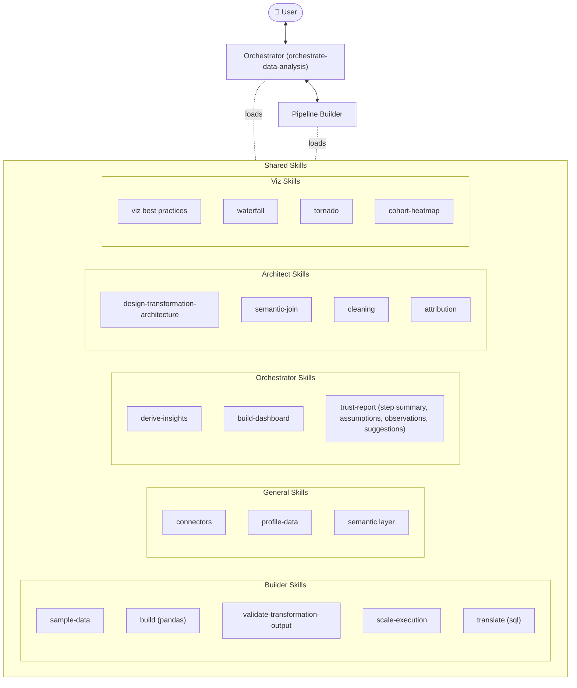

```mermaid
flowchart TD
    User(["👤 User"])

    ORC["Orchestrator (orchestrate-data-analysis)"]

    PB["Pipeline Builder"]

    subgraph SH["Shared Skills"]
        subgraph BS["Builder Skills"]
            Sample["sample-data"]
            BX["build (pandas)"]
            Validate["validate-transformation-output"]
            Scale["scale-execution"]
            Translate["translate (sql)"]
        end
        subgraph GS["General Skills"]
            CN["connectors"]
            GL["profile-data"]
            SL["semantic layer"]
        end
        subgraph OS["Orchestrator Skills"]
            Insights["derive-insights"]
            Viz["build-dashboard"]
            Trust["trust-report (step summary, assumptions, observations, suggestions)"]
        end
        subgraph AS["Architect Skills"]
            Architect["design-transformation-architecture"]
            SJ["semantic-join"]
            CL["cleaning"]
            AT["attribution"]
        end
        subgraph VS["Viz Skills"]
            VGP["viz best practices"]
            WF["waterfall"]
            TR["tornado"]
            CH["cohort-heatmap"]
        end
    end

    User <--> ORC <--> PB
    ORC -. loads .- SH
    PB -. loads .- SH
```
