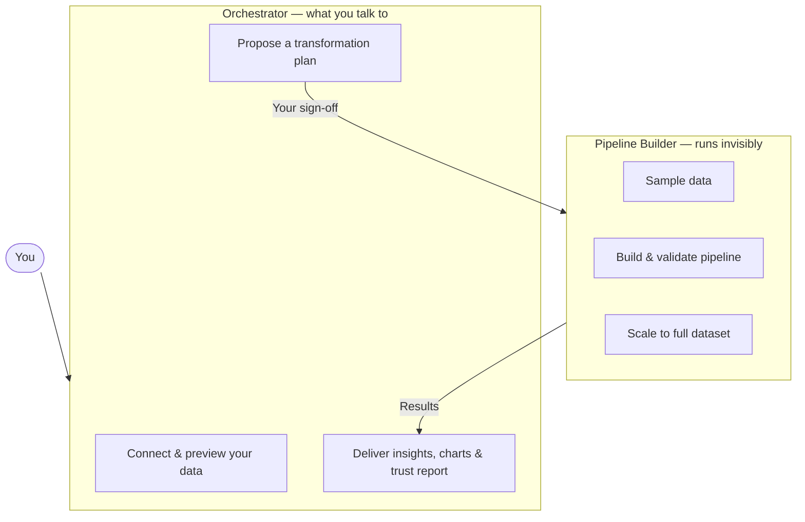

# Yorph Data Analyst

Describe what you want to know — in plain English — and get back cleaned data, a transformation pipeline, charts, and a plain-language summary of findings.

You don't write SQL. You don't configure a pipeline. You describe the question, sign off on the plan, and the plugin handles the rest.

Designed for business users: FP&A analysts, ops teams, and anyone who needs answers from data without wanting to touch the tooling.

*↑ Example output — [open live dashboard](https://htmlpreview.github.io/?https://raw.githubusercontent.com/YorphAI/plugin-marketplace/main/yorph-data-analyst/examples/sales-insights-dashboard.html)*

---

## How it works

Two agents work together behind the scenes:

**Orchestrator** — the only agent you interact with. It previews your data, proposes what it's going to do, waits for your approval, then delivers results in plain English.

**Pipeline Builder** — never talks to you. It receives a structured handoff from the Orchestrator, builds and validates the transformation, scales it, and hands results back.

---

## What you get

- Cleaned, transformed data ready for downstream use
- Charts and a summary dashboard
- A **trust report** — what the pipeline did, what it assumed, and where to double-check

---

## Skills

| Agent | Skills |
|---|---|
| Orchestrator | `connect-data-source`, `design-transformation-architecture`, `derive-insights`, `build-dashboard`, `trust-report` |
| Pipeline Builder | `sample-data`, `validate-transformation-output`, `scale-execution` |

---

## Installation

**Option A — via the Yorph GitHub marketplace**

In Claude Code: **Customize → Browse Plugins → Personal → + → Add Marketplace from GitHub** → enter `https://github.com/YorphAI/plugin-marketplace` → install **yorph-data-analyst**.

**Option B — zip upload**

Download [`yorph-data-analyst.zip`](./yorph-data-analyst.zip), then in Claude Code: **Customize → + next to Personal Plugins → upload zip**.
