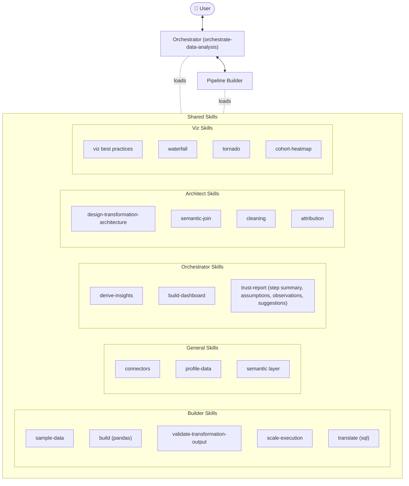

# Yorph Data Analyst

Describe what you want to know — in plain English — and get back cleaned data, a transformation pipeline, charts, and a plain-language summary of findings.

You don't write SQL. You don't configure a pipeline. You describe the question, sign off on the plan, and the plugin handles the rest.

Designed for business users: FP&A analysts, ops teams, and anyone who needs answers from data without wanting to touch the tooling.

---

## What you get

- Cleaned, transformed data ready for downstream use
- Charts and a summary dashboard
- A **trust report** — what the pipeline did, what it assumed, and where to double-check

---

## Installation

**Option A — via the Yorph GitHub marketplace**

In Claude Code: **Customize → Browse Plugins → Personal → + → Add Marketplace from GitHub** → enter `https://github.com/YorphAI/plugin-marketplace` → install **yorph-data-analyst**.

**Option B — zip upload**

Download [`yorph-data-analyst.zip`](./yorph-data-analyst.zip), then in Claude Code: **Customize → + next to Personal Plugins → upload zip**.

---

## How it works

Two agents share a library of skills. The Orchestrator is the only one you talk to — it plans, gets your sign-off, delegates execution to the Pipeline Builder, and delivers results. The Pipeline Builder runs invisibly: it builds, validates, and scales the transformation, then hands results back.

### Skills

| Group | Skills |
|---|---|
| **Orchestrator** | `derive-insights`, `build-dashboard`, `trust-report` |
| **Architect** | `design-transformation-architecture`, `semantic-join`, `cleaning`, `attribution` |
| **Builder** | `sample-data`, `build (pandas)`, `validate-transformation-output`, `scale-execution`, `translate (sql)` |
| **General** | `connectors`, `profile-data`, `semantic layer` |
| **Viz** | `viz best practices`, `waterfall`, `tornado`, `cohort-heatmap` |

