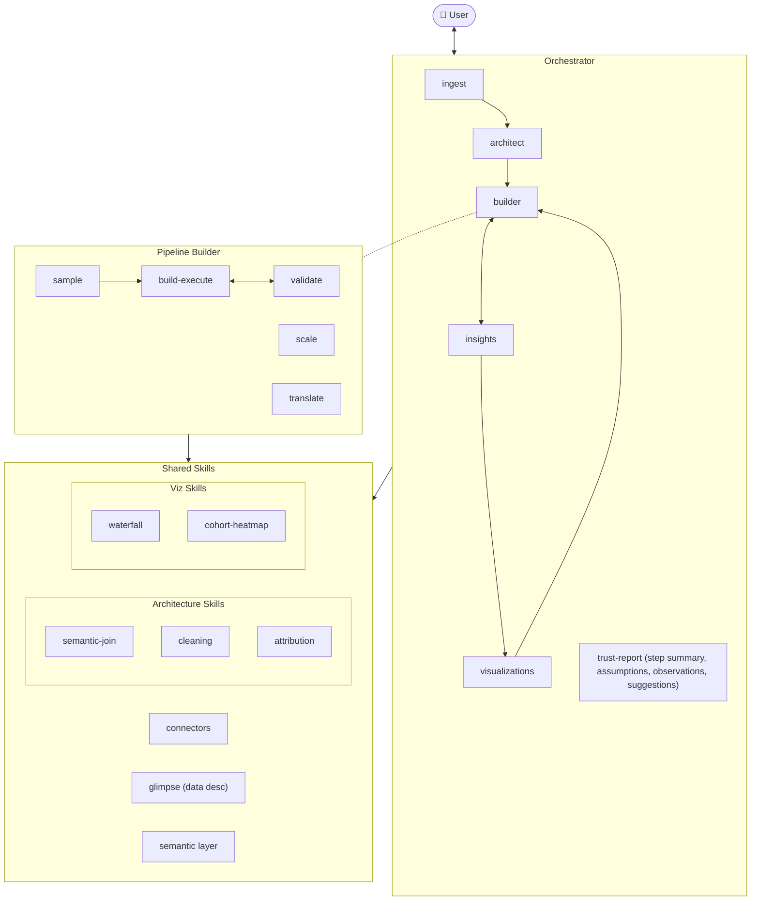

```mermaid
flowchart TD
    User(["👤 User"])

    subgraph ORC["Orchestrator"]
        Ingest["ingest"]
        Architect["architect"]
        Build["builder"]
        Insights["insights"]
        Viz["visualizations"]
        Trust["trust-report (step summary, assumptions, observations, suggestions)"]
    end

    subgraph PB["Pipeline Builder"]
        Sample["sample"]
        BX["build-execute"]
        Validate["validate"]
        Scale["scale"]
        Translate["translate"]
    end

    subgraph SH["Shared Skills"]
        CN["connectors"]
        GL["glimpse (data desc)"]
        SL["semantic layer"]
        subgraph AS["Architecture Skills"]
            SJ["semantic-join"]
            CL["cleaning"]
            AT["attribution"]
        end
        subgraph VS["Viz Skills"]
            WF["waterfall"]
            CH["cohort-heatmap"]
        end
    end

    User <--> ORC
    Ingest --> Architect --> Build <--> Insights
    Build -.- PB
    ORC --> SH
    PB --> SH
    Sample --> BX <--> Validate
    Insights --> Viz
    Viz --> Build
```